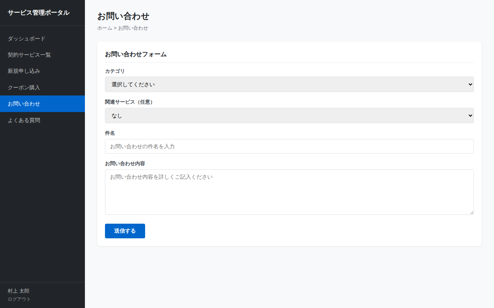

# お問い合わせ画面仕様書

## 基本情報

| 項目 | 内容 |
|------|------|
| 画面ID | SCR-CONTACT |
| 画面名 | お問い合わせ |
| ファイル | contact.html |
| URL | /contact.html |
| 認証 | 要ログイン |

## 画面概要

（自動更新により記載予定）

## スクリーンショット

## 表示項目

（自動更新により記載予定）

## 操作仕様

サイドバーには「新規申し込み」「クーポン購入」「お問い合わせ」に加え、「よくある質問」リンクが追加されました。「よくある質問」リンクをクリックすると、FAQページに遷移します。

## バリデーション

（自動更新により記載予定）

## 画面遷移

（自動更新により記載予定）
