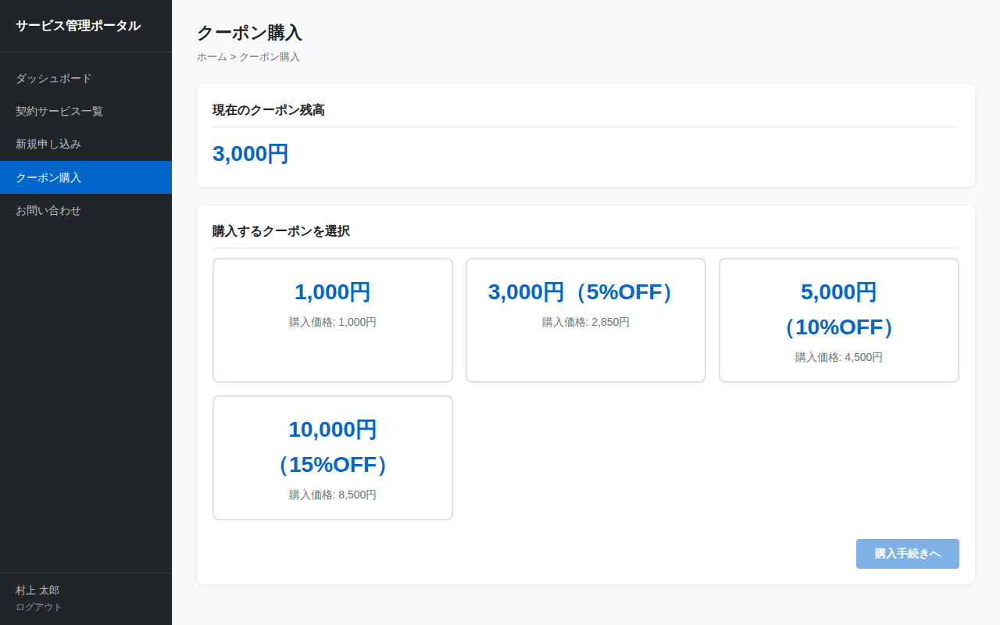

# クーポン購入画面仕様書

## 基本情報

| 項目 | 内容 |
|------|------|
| 画面ID | SCR-COUPON |
| 画面名 | クーポン購入 |
| ファイル | coupon.html |
| URL | /coupon.html |
| 認証 | 要ログイン |

## 画面概要

サービス利用料に充当できるクーポンを購入する画面。額面の異なるクーポン（まとめ買い割引あり）から選択し、購入確認を経て購入を完了する。

## スクリーンショット

## 表示項目

### クーポン残高カード

| No. | 項目名 | 説明 |
|-----|--------|------|
| 1 | ラベル | 「現在のクーポン残高」 |
| 2 | 残高 | 現在のクーポン残高金額（大きい青文字） |

### クーポン選択カード

3列のグリッドで表示する。

| No. | 額面 | 購入価格 | 割引率 |
|-----|------|----------|--------|
| 1 | 1,000円 | 1,000円 | なし |
| 2 | 3,000円 | 2,850円 | 5%OFF |
| 3 | 5,000円 | 4,500円 | 10%OFF |
| 4 | 10,000円 | 8,500円 | 15%OFF |

各カードの表示要素:
- 額面（大きい青文字）
- 購入価格（小さいグレー文字、「購入価格:」ラベル付き）

### 未読お知らせカード

| No. | 項目名 | 説明 |
|-----|--------|------|
| 1 | ラベル | 「未読お知らせ」 |
| 2 | 未読数 | 直近7日以内のお知らせの未読数（大きい青文字） |

### 操作ボタン

| No. | ボタン名 | 表示条件 | 動作 |
|-----|----------|----------|------|
| 1 | 購入手続きへ | 初期状態は非活性（disabled） | クーポン選択後に活性化。購入確認モーダルを表示 |

## 操作仕様

### クーポンカード選択

カードをクリックすると、そのカードが選択状態（青枠 + 薄青背景）になる。他のカードの選択は解除される（単一選択）。カード選択後、「購入手続きへ」ボタンが活性化される。

### 「購入手続きへ」ボタン押下

購入確認モーダルを表示する。

### 購入確認モーダル

| 要素 | 内容 |
|------|------|
| タイトル | 「購入確認」 |
| メッセージ | 「以下のクーポンを購入しますか？」 |
| クーポン額面 | 選択したクーポンの額面 |
| 購入価格 | 選択したクーポンの購入価格 |
| キャンセルボタン | モーダルを閉じる。何もしない |
| 購入するボタン | 購入処理を実行し、完了ビューに遷移する |

### 購入完了ビュー

購入が完了すると、クーポン選択ビューが非表示になり、完了ビューが表示される。

| No. | 項目名 | 説明 |
|-----|--------|------|
| 1 | 完了アイコン | チェックマーク（✔） |
| 2 | 完了メッセージ | 「クーポンを購入しました」 |
| 3 | 購入額 | 購入したクーポンの額面 |
| 4 | 新しい残高 | 購入後のクーポン残高 |
| 5 | 戻るリンク | 「クーポン購入画面に戻る」ボタン |

## 画面遷移

| 遷移元 | 操作 | 遷移先 |
|--------|------|--------|
| サイドバー | クーポン購入リンク | この画面 |
| この画面 | 購入完了 → 戻るリンク | この画面（リロード） |
