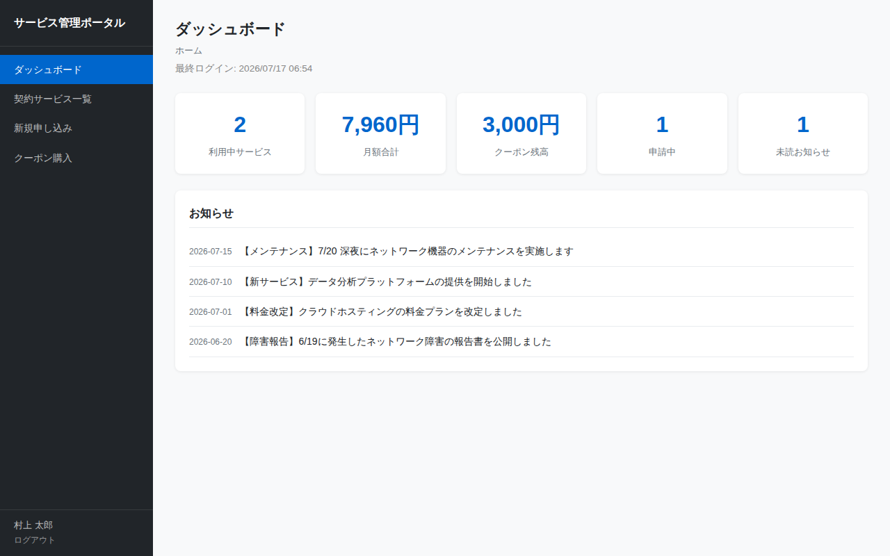

# ダッシュボード画面仕様書

## 基本情報

| 項目 | 内容 |
|------|------|
| 画面ID | SCR-DASHBOARD |
| 画面名 | ダッシュボード |
| ファイル | dashboard.html |
| URL | /dashboard.html |
| 認証 | 要ログイン |

## 画面概要

ログイン後に最初に表示されるホーム画面。利用中サービスの概況をサマリーカードで表示し、システムからのお知らせを一覧表示する。新たに「未読お知らせ」カードが追加され、直近7日以内のお知らせが未読としてカウントされる。

## スクリーンショット

## 表示項目

### サマリーカード

5つのカードを横並びで表示する。

| No. | カード名 | 表示値 | 算出方法 |
|-----|----------|--------|----------|
| 1 | 利用中サービス | 件数 | ステータスが「利用中（active）」のサービス数 |
| 2 | 月額合計 | 金額 | ステータスが「利用中」のサービスの月額料金合計 |
| 3 | クーポン残高 | 金額 | ユーザーの現在のクーポン残高 |
| 4 | 申請中 | 件数 | ステータスが「申請中（pending）」のサービス数 |
| 5 | 未読お知らせ | 件数 | 直近7日以内のお知らせの数 |

### お知らせ一覧

| No. | 項目 | 説明 |
|-----|------|------|
| 1 | 日付 | お知らせの掲載日（YYYY-MM-DD形式、グレー小文字） |
| 2 | 本文 | お知らせの内容テキスト |

## 操作仕様

### サイドバーナビゲーション

| リンク | 遷移先 |
|--------|--------|
| ダッシュボード | dashboard.html（現在の画面） |
| 契約サービス一覧 | services.html |
| 新規申し込み | apply.html |
| クーポン購入 | coupon.html |

### ログアウトリンク押下

セッション情報をクリアし、ログイン画面（login.html）に遷移する。

## 画面遷移

| 遷移元 | 操作 | 遷移先 |
|--------|------|--------|
| ログイン画面 | ログイン成功 | この画面 |
| この画面 | サイドバー「契約サービス一覧」 | 契約サービス一覧 |
| この画面 | サイドバー「新規申し込み」 | 新規申し込み |
| この画面 | サイドバー「クーポン購入」 | クーポン購入 |
| この画面 | ログアウト | ログイン画面 |
