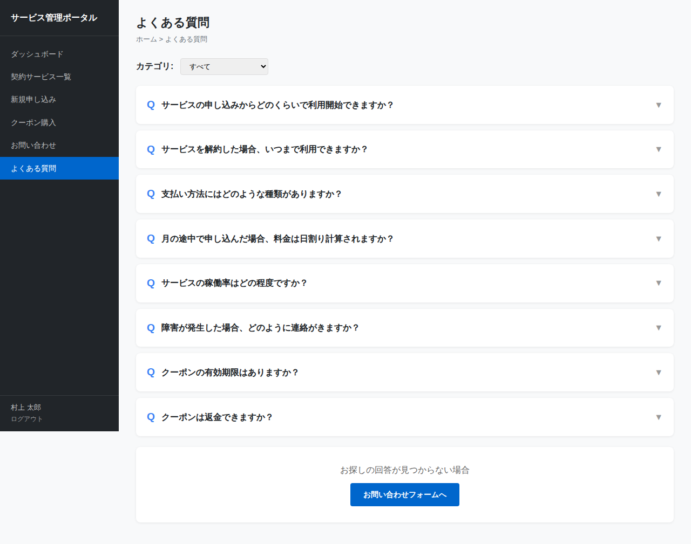

# よくある質問画面仕様書

## 基本情報

| 項目 | 内容 |
|------|------|
| 画面ID | SCR-FAQ |
| 画面名 | よくある質問 |
| ファイル | faq.html |
| URL | /faq.html |
| 認証 | 要ログイン |

## 画面概要

ユーザーがよくある質問をカテゴリ別に閲覧できるFAQ画面。アコーディオン形式で質問と回答を表示し、カテゴリフィルターによる絞り込みが可能。回答が見つからない場合はお問い合わせフォームへ誘導する。

## スクリーンショット

## 表示項目

### カテゴリフィルター

| No. | 項目 | 種別 | 説明 |
|-----|------|------|------|
| 1 | カテゴリ | ドロップダウン | FAQ表示カテゴリを選択する |

#### カテゴリ選択肢

| 値 | 表示テキスト |
|-----|-------------|
| all | すべて |
| contract | 契約について |
| billing | 料金・請求について |
| technical | 技術的な質問 |
| coupon | クーポンについて |

### FAQ一覧

各質問はカード形式で表示され、クリックで回答を展開するアコーディオン構成。

| No. | 項目 | 説明 |
|-----|------|------|
| 1 | Qラベル | 青色太字の「Q」アイコン |
| 2 | 質問テキスト | 太字で表示 |
| 3 | 展開アイコン | ▼（閉）/ ▲（開）で状態を示す |
| 4 | Aラベル | 緑色太字の「A」アイコン（展開時のみ表示） |
| 5 | 回答テキスト | グレー文字で表示（展開時のみ表示） |

### FAQ項目一覧

| No. | カテゴリ | 質問 | 回答 |
|-----|----------|------|------|
| 1 | 契約について | サービスの申し込みからどのくらいで利用開始できますか？ | お申し込み後、審査完了まで1～3営業日。審査完了後すぐに利用可能 |
| 2 | 契約について | サービスを解約した場合、いつまで利用できますか？ | 解約手続き後、当月末まで利用可能。翌月1日にサービス停止 |
| 3 | 料金・請求について | 支払い方法にはどのような種類がありますか？ | クレジットカード、口座振替、請求書払い（法人契約のみ） |
| 4 | 料金・請求について | 月の途中で申し込んだ場合、料金は日割り計算されますか？ | 初月・解約月ともに日割り計算 |
| 5 | 技術的な質問 | サービスの稼働率はどの程度ですか？ | SLAとして月間稼働率99.9%を保証。計画メンテナンスは事前通知 |
| 6 | 技術的な質問 | 障害が発生した場合、どのように連絡がきますか？ | ダッシュボードのお知らせ欄と登録メールアドレスに通知 |
| 7 | クーポンについて | クーポンの有効期限はありますか？ | 購入日から1年間。期限を過ぎた残高は失効 |
| 8 | クーポンについて | クーポンは返金できますか？ | 原則返金不可。サービス利用料への充当のみ |

### お問い合わせ誘導エリア

| No. | 項目 | 説明 |
|-----|------|------|
| 1 | 案内文 | 「お探しの回答が見つからない場合」（グレー文字） |
| 2 | お問い合わせボタン | 「お問い合わせフォームへ」ボタン（プライマリ） |

## 操作仕様

### カテゴリフィルター変更

カテゴリドロップダウンの値変更時、`filterFAQ()` により選択カテゴリに一致するFAQ項目のみ再描画する。「すべて」選択時は全件表示。

### アコーディオン開閉

| 操作 | 動作 |
|------|------|
| 閉じた状態のカードをクリック | 回答エリアを表示、アイコンを▲に変更 |
| 開いた状態のカードをクリック | 回答エリアを非表示、アイコンを▼に変更 |

### お問い合わせボタン押下

お問い合わせ画面（contact.html）へ遷移する。

## 画面遷移

| 遷移元 | 操作 | 遷移先 |
|--------|------|--------|
| サイドバー | 「よくある質問」リンク | この画面 |
| この画面 | 「お問い合わせフォームへ」ボタン | お問い合わせ画面 |
| この画面 | サイドバー「ダッシュボード」 | ダッシュボード |
| この画面 | サイドバー「契約サービス一覧」 | 契約サービス一覧 |
| この画面 | サイドバー「新規申し込み」 | 新規申し込み |
| この画面 | サイドバー「クーポン購入」 | クーポン購入 |
| この画面 | サイドバー「お問い合わせ」 | お問い合わせ |
| この画面 | ログアウト | ログイン画面 |

## エラーハンドリング

| 条件 | 動作 |
|------|------|
| 未ログイン状態でアクセス | ログイン画面へリダイレクト |
| 選択カテゴリに該当するFAQが0件 | FAQ一覧エリアが空表示となる |
