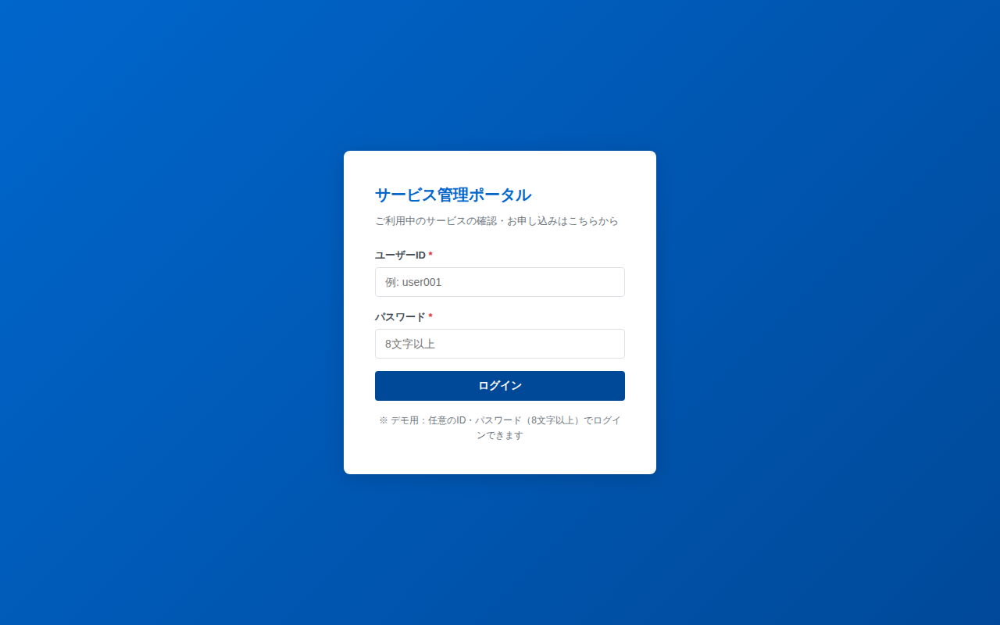

# ログイン画面仕様書

## 基本情報

| 項目 | 内容 |
|------|------|
| 画面ID | SCR-LOGIN |
| 画面名 | ログイン |
| ファイル | login.html |
| URL | /login.html |

## 画面概要

ユーザーIDとパスワードを入力してシステムにログインする画面。認証成功後、ダッシュボードに遷移する。

## スクリーンショット

## 表示項目

| No. | 項目名 | 要素 | 必須 | 説明 |
|-----|--------|------|------|------|
| 1 | タイトル | テキスト | - | 「サービス管理ポータル」固定表示 |
| 2 | サブタイトル | テキスト | - | 「ご利用中のサービスの確認・お申し込みはこちらから」 |
| 3 | ユーザーID | テキスト入力 | ○ | プレースホルダー「例: user001」 |
| 4 | パスワード | パスワード入力 | ○ | プレースホルダー「8文字以上」 |
| 5 | ログインボタン | ボタン | - | プライマリボタン（青、幅100%） |

## 操作仕様

### ログインボタン押下

| 条件 | 動作 |
|------|------|
| ユーザーIDが空 | 入力欄を赤枠にし、「ユーザーIDを入力してください」を表示。遷移しない |
| パスワードが空 | 入力欄を赤枠にし、「パスワードを入力してください」を表示。遷移しない |
| パスワードが8文字未満 | 入力欄を赤枠にし、「パスワードは8文字以上で入力してください」を表示。遷移しない |
| 上記以外 | セッションにログイン状態を保存し、ダッシュボード画面（dashboard.html）に遷移する |

## バリデーション

| 項目 | ルール | エラーメッセージ |
|------|--------|------------------|
| ユーザーID | 必須入力 | ユーザーIDを入力してください |
| パスワード | 必須入力 | パスワードを入力してください |
| パスワード | 8文字以上 | パスワードは8文字以上で入力してください |

## 画面遷移

| 遷移元 | 操作 | 遷移先 |
|--------|------|--------|
| - | ログイン成功 | ダッシュボード（dashboard.html） |
